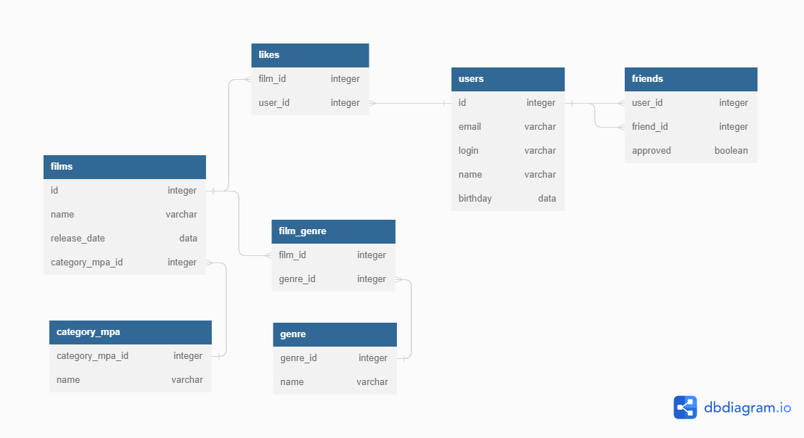

# java-filmorate

https://dbdiagram.io/d/64a2941502bd1c4a5e670659



## Описание диаграммы базы фильмов\пользователей

База данных состоит из следующих таблиц:
1.	films – данные по внесенным в базу фильмам
2.	likes – идентификаторы пользователей поставивших лайк фильму
3.	category_mpa – наименования рейтингов фильмов Ассоциации кинокомпаний
4.	genre – наименования жанров фильмов
5.	film_genre – фильмы и жанры этих фильмов
6.	users – данные пользователей сервиса
7.	friends – идентификаторы пользователей, добавленных в друзья, информация о подтверждении «дружбы» от добавленных пользователей

## Поля и ключи таблиц:

### `films`
1.	id  (PK) – уникальный идентификатор фильма 
2.	name – наименование фильма
3.	release_date – дата выхода на экраны (YYYY-MM-DD)
4.	category_mpa_id (FK) – идентификатор рейтинга

### `likes` 
1.	film_id (PK) – идентификатор  фильма
2.	user_id (FK) – идентификатор пользователя, лайкнувшего фильм

### `film_genre`
1.	film_id (PK) – идентификатор фильма
2.	genre_id (FK) – идентификатор жанра

### `genre` 
1.	genre_id (PK) – идентификатор жанра
2.	name – наименование жанра

### `category_mpa` 
1.	category_mpa_id (PK) – идентификатор рейтингов Ассоциации кинокомпаний
2.	name – наименование рейтинга

### `users`
1.	id (PK) – идентификатор пользователя
2.	email – эл. почта пользователя
3.	login – логин пользователя
4.	name – имя пользователя
5.	birthday – дата рождения пользователя

### `friends` 
1.	user_id (PK) – идентификатор пользователя
2.	friend_id (FK) – идентификатор друга пользователя
3.	approved – показывает, подтвержден ли запрос на добавления в друзья (false/true)

## Примеры запросов:
1. Получить названия всех мультфильмов, вышедших в 2019 год отсортированных в алфавитном порядке:
```
   SELECT name,
         release_date
   FROM films
   WHERE EXTRACT(YEAR FROM release_date) = 2019 AND id IN (
           SELECT film_id
           FROM film_genre
           WHERE genre_id = (
                             SELECT genre_id
                             FROM genre
                             WHERE name = 'ANIMATION'))
   ORDER BY release_date;
   ```
2. Получить данные о 10 пользователей с самым большим количеством подтвержденных друзей
```
  SELECT *
  FROM users
  WHERE id IN (SELECT user_id
               FROM friends
               WHERE approved = TRUE
               ORDER BY COUNT(friend_id) DESC
               LIMIT 10);
  ```

   
