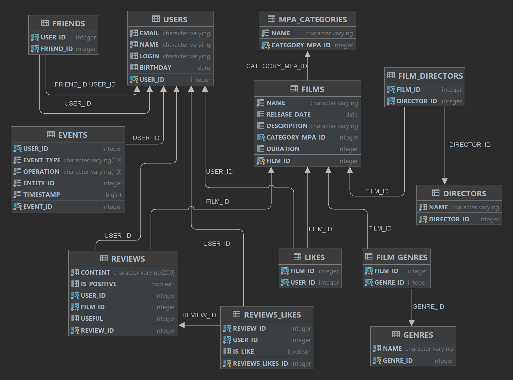

# Filmorate

## Описание приложения

Представьте, что Вы решили отдохнуть и провести вечер за просмотром фильма. Вкусная еда уже готовится, любимый плед
уютно свернулся на кресле — а вы всё ещё не выбрали, что же посмотреть!
Фильмов много — и с каждым годом становится всё больше. Чем их больше, тем больше разных оценок. Чем больше оценок, тем
сложнее сделать выбор.
Сервис Filmorate работает с фильмами и оценками пользователей, а также возвращает фильмы, рекомендованные к
просмотру. Теперь ни Вам, ни вашим друзьям не придётся долго размышлять, что посмотреть вечером. Рейтинг фильмов
составляется на основе отзывов пользователей.

### Разработка на Spring Boot.

Параметры:

- group: ru.yandex.practicum;
- artifact: filmorate;
- name: filmorate;
- dependencies: Spring Web.

## Модели данных

Модели данных хранятся в пакете model.
В него входят классы:

- Film – фильм,
- User – пользователь,
- Genre – жанр фильма,
- MpaCategory – категория MPA по рейтингу Американской Киноассоциации,
- Director – режиссер фильма,
- Review – отзыв пользователя о фильме,
- Event - событие произошедшее на платформе: добавление в друзья, удаление из друзей, лайки и отзывы, которые оставили
  пользователи.

__*Свойства model.Film:*__

1. целочисленный идентификатор — long id;
2. название — String name;
3. описание — String description;
4. дата релиза — LocalDate releaseDate;
5. продолжительность фильма — int duration;
6. категория MPA фильма – MpaCategory mpa;
7. перечень режиссеров – Set<Director> directors;
8. перечень жанров – Set<Genre> genres;
9. перечень пользователей, поставивших лайк – Set<User> likes.

__*Свойства model.User:*__

1. целочисленный идентификатор — long id;
2. электронная почта — String email;
3. логин пользователя — String login;
4. имя для отображения — String name;
5. дата рождения — LocalDate birthday.

__*Свойство model.Genre:*__

1. целочисленный идентификатор — int id;
2. название для отображения — String name.

__*Свойство model.MpaCategory:*__

1. целочисленный идентификатор — int id;
2. название для отображения — String name.

__*Свойство model.Director:*__

1. целочисленный идентификатор — int id;
3. название для отображения — String name.

__*Свойство model.Review:*__

1. целочисленный идентификатор — Long reviewId;
2. содержание отзыва – String content;
3. тип отзыва: позитивный/негативный – Boolean isPositive;
4. идентификатор пользователя, оставившего отзыв – Long userId;
5. идентификатор фильма, на который оставлен отзыв – Long filmId;
6. рейтинг полезности отзыва – int useful.

__*Свойство model.Event:*__

1. целочисленный идентификатор — Long eventId;
2. идентификатор пользователя, инициировавшего событие – Long userId;
3. тип события - EventType eventType, может быть LIKE, REVIEW или FRIEND;
4. идентификатор сущности, с которой произошло событие - Long entityId;
5. характеристика события - Operation operation, может быть REMOVE, ADD, UPDATE;
6. отметка времени события в милисекундах - Long timestamp.

## REST-контроллеры

**Классы-контроллеры:**

- FilmController обслуживает фильмы,
- UserController — пользователей,
- GenreController – жанры,
- DirectorController – режиссеров,
- MpaCategoryController – категории,
- ReviewController - отзывы.

В классах-контроллерах имеются эндпоинты с подходящим типом запроса для каждого из случаев.

Для FilmController:

1. POST /films - добавление фильма.
2. PUT /films - обновление фильма.
3. GET /films - получение всех фильмов.
4. GET /films/{filmId} – получение фильма по идентификатору.
5. DELETE /films/{filmId} – удаление фильма.
6. PUT /films/{filmId}/like/{userId} — пользователь ставит лайк фильму.
7. DELETE /films/{filmId}/like/{userId} — пользователь удаляет лайк.
8. GET /films/{filmId}/likes – список пользователей лайкнувших фильм.
9. GET /films/{filmId}/genres – список жанров фильма.
10. GET /films/popular?count={count}&genreId={genreId}&year={year} — возвращает список из первых count фильмов по
    количеству лайков. Если значение параметра count не задано, вернутся первые 10. Фильтрация осуществляется по двум
    параметрам: по жанру, за указанный год.
11. GET /films/director/{directorId}?sortBy=[year,likes] – Возвращает список фильмов режиссера отсортированных по
    количеству лайков или году выпуска.
12. GET /films/search?query={query}&by={director,title} - список фильмов, отсортированных по популярности – результат
    поиска по названию фильмов и по режиссёру, query — текст для поиска, by — может принимать значения director (поиск
    по режиссёру), title (поиск по названию), либо оба значения через запятую при поиске одновременно и по режиссеру и
    по названию.
13. GET /films/common?userId={userId}&friendId={friendId} - возвращает список фильмов, отсортированных по популярности.
    Параметры: userId — идентификатор пользователя, запрашивающего информацию; friendId — идентификатор пользователя, с
    которым необходимо сравнить список фильмов.

Для UserController:

1. POST /users - создание пользователя.
2. PUT /users - обновление пользователя.
3. DELETE /users/{userId} – удаление пользователя.
4. GET /users/{userId} - получение данных о конкретном пользователе.
5. GET /users - получение списка всех пользователей.
6. PUT /users/{userId}/friends/{friendId} — добавление в друзья.
7. DELETE /users/{userId}/friends/{friendId} — удаление из друзей.
8. GET /users/{userId}/friends — возвращает список пользователей, являющихся его друзьями.
9. GET /users/{userId}/friends/common/{otherId} — список друзей, общих с другим пользователем.
10. GET /users//{userId}/feed - получение списка списка событий, которые пользователь совершил на платформе.
11. GET /users/{userId}/recommendations – список рекомендаций.

Для DirectorController:
1. GET /directors - список всех режиссёров.
2. GET /directors/{id}- получение режиссёра по идентификатору.
3. POST /directors - создание режиссёра.
4. PUT /directors - изменение режиссёра.
5. DELETE /directors/{id} - удаление режиссёра.

Для MpaCategoryController:
1. GET /mpa – получение всех категорий MPA.
2. GET /mpa/{id} – получение категории по идентификатору.
3. POST /mpa - создание категории.

Для GenreController:
1. GET /genres – получение списка всех жанров.
2. GET /genres/{id} – получение жанра по идентификатору.
3. POST /genres – создание жанра.

Для ReviewController:
1. POST /reviews - добавление нового отзыва.
2. PUT /reviews - редактирование уже имеющегося отзыва.
3. DELETE /reviews/{id} - удаление уже имеющегося отзыва.
4. GET /reviews/{id} - получение отзыва по идентификатору.
5. GET /reviews?filmId={filmId}&count={count} - получение всех отзывов по идентификатору фильма, если фильм не указан то
   получение всех фильмов. Если кол-во не указано, то 10.
6. PUT /reviews/{id}/like/{userId} - пользователь ставит лайк отзыву.
7. PUT /reviews/{id}/dislike/{userId} - пользователь ставит дизлайк отзыву.
8. DELETE /reviews/{id}/like/{userId} - пользователь удаляет лайк/дизлайк отзыву.
9. DELETE /reviews/{id}/dislike/{userId} - пользователь удаляет дизлайк отзыву.

Эндпоинты для **создания и обновления** данных должны также вернуть созданную или изменённую сущность.

## Бизнес логика 

Пользователям должны иметь возможность добавлять друг друга в друзья и ставить фильмам лайки.

Бизнес-логика объединена в пакете service. Кроме основных функций добавления / изменения / удаления, классы этого пакета поддерживают дополнительные возможности.
#### 1. Класс UserService, дополнительно к простым функциям отвечает за такие операции с пользователями, как:
- Добавление в друзья. Если User1 добавляет User2 в друзья, то User2 попадает в список друзей User1, но User1 не попадает в список друзей User2. Обоюдной дружба станет только, когда User2 отдельно добавит User1 в друзья.
- Удаление из друзей.
- Вывод списка общих друзей. 
- Получение списка друзей пользователя.
- Получение рекомендаций по просмотру фильмов. Происходит поиск пользователя, с максимальным количеством пересечений по лайкам. Определяется, какие фильмы найденный пользователь пролайкал, а первый нет. Выводится список фильмов, которым поставил лайк пользователь с похожими вкусами, а тот, для кого составляется рекомендация, ещё не поставил. 
- Получение ленты событий по идентификатору пользователя. Событием считается: добавление, изменение, удаление отзыва на фильм; добавление пользователя в друзья; удаление из друзей; добавление, удаление лайка фильму.

#### 2. Класс FilmService, отвечает за операции с фильмами. Кроме простых операций реализован следующий функционал:
- Добавление лайка. Каждый пользователь может поставить лайк фильму несколько раз.
- Удаление лайка.
- Вывод заданного количества наиболее популярных фильмов по количеству лайков, с возможностью фильтрации по идентификатору жанра и/или году создания фильма.
- Вывод общих с другом фильмов (оба «лайкнули» фильм)  с сортировкой по их популярности. 
- Поиск фильма по переданному тексту. Поиск происходит по полному или частичному совпадению строки текста с именем режиссера и/или названием фильма без учета регистра.
- Вывод всех фильмов режиссёра, отсортированных по количеству лайков.
- Вывод всех фильмов режиссёра, отсортированных по годам.
- Вывод рекомендаций по фильмам для просмотра. 

#### 3. Класс ReviewService, отвечает за операции с отзывами:
- Отзыв должен иметь характеристику: положительный, отрицательный.
- Получение конкретного отзыва.
- Получение всех отзывов к фильму.
- Выставление отзыву оценки  (лайк / дизлайк) от пользователя, на основе которых у отзыва формируется рейтинг полезности.


## Валидация
Данные, которые приходят в запросе на добавление нового фильма или пользователя проверяются. Эти данные должны соответствовать определённым критериям. 

Для Film:

- название не может быть пустым;
- максимальная длина описания — 200 символов;
- дата релиза — не раньше 28 декабря 1895 года;
- продолжительность фильма должна быть положительной.

Для User:
- электронная почта не может быть пустой и должна содержать символ @;
- логин не может быть пустым и содержать пробелы;
- имя для отображения может быть пустым — в таком случае будет использован логин;
- дата рождения не может быть в будущем.

Для Review:
- содержание отзыва не может быть пустым, минимальная длина содержания – 10 символов, максимальная длина – 200 символов.

Приложение возвращает HTTP-коды: 
-	400 — если ошибка валидации;
-	404 — для всех ситуаций, если искомый объект не найден;
-	500 — если возникло исключение.

## Логирование
Логирование осуществляется в слое контроллеров, при получении данных из базы данных, при возникновении ошибок — например, если валидация не пройдена. 

## Тестирование
Тесты для валидации пользователя. Подтверждают, что она работает на граничных условиях.
Интеграционные тесты для проверки взаимодействия с базой данных. 

## Схема базы данных и ее описание


В проекте использована база данных H2.

PK - primary key
FK - foreign key

### `films`

1. film_id  (PK) – уникальный идентификатор фильма
2. name – наименование фильма
3. release_date – дата выхода на экраны (YYYY-MM-DD)
4. description - описание фильма
5. category_mpa_id (FK) – идентификатор рейтинга
6. duration - продолжительность в минутах

### `likes`

1. film_id (FK) – идентификатор фильма
2. user_id (FK) – идентификатор пользователя, лайкнувшего фильм

### `film_genres`

1. film_id (FK) – идентификатор фильма
2. genre_id (FK) – идентификатор жанра

### `genres`

1. genre_id (PK) – идентификатор жанра
2. name – наименование жанра

### `mpa_categories`

1. category_mpa_id (PK) – идентификатор рейтингов Ассоциации кинокомпаний
2. name – наименование рейтинга

### `directors`

1. director_id (PK) - идентификатор режиссера
2. name - ФИО режиссера

### `film_directors`

1. film_id (FK) - идентификатор фильма
2. director_id (FK) - идентификатор режиссера

### `users`

1. user_id (PK) – идентификатор пользователя
2. email – эл. почта пользователя
3. login – логин пользователя
4. name – имя пользователя
5. birthday – дата рождения пользователя

### `friends`

1. user_id (FK) – идентификатор пользователя
2. friend_id (FK) – идентификатор друга пользователя

### `reviews`

1. review_id (PK) - идентификатор отзыва
2. content - содержание отзыва
3. is_positive - характеристика: положительный / отрицательный
4. user_id (FK) - идентификатор пользователя
5. film_id (FK) - идентификатор фильма
6. useful - рейтинг отзыва по количеству лайков / дизлайков

### `reviews_likes`

1. reviews_likes_id (PK) - идентификатор лайка / дизлайка
2. review_id (FK) - идентификатор отзыва
3. user_id (FK) - идентификатор пользователя
4. is_like - принимает значения: true - если поставлен лайк, false - если дизлайк 

### `events`

1. event_id (PK) - идентификатор события
2. user_id (FK) - идентификатор пользователя
3. event_type - тип события, которое произошло
4. operation - вид операции (добавление, удаление, изменение)
5. entity_id - идентификатор сущности, с которой произошло событие
6. timestamp - временная отметка произошедшего события

## Примеры запросов:

1. Получить данные по фильму с ID 2, включая наименование категоии МРА:

```
    SELECT F.FILM_ID, 
        F.NAME AS FILM_NAME, 
        F.RELEASE_DATE, 
        F.DESCRIPTION, 
        F.DURATION, 
        F.CATEGORY_MPA_ID, 
        M.NAME AS MPA_NAME 
    FROM FILMS AS F 
    JOIN MPA_CATEGORIES AS M ON F.CATEGORY_MPA_ID = M.CATEGORY_MPA_ID 
    WHERE F.FILM_ID = 2;
   ```

2. Получить список из 10 самых популярных фильмов:

```
    SELECT F.FILM_ID, 
        F.NAME AS FILM_NAME, 
        F.RELEASE_DATE, 
        F.DESCRIPTION, 
        F.DURATION, 
        F.CATEGORY_MPA_ID, 
        M.NAME AS MPA_NAME, 
        COUNT(L.USER_ID) AS RT
    FROM FILMS AS F 
    JOIN MPA_CATEGORIES AS M ON F.CATEGORY_MPA_ID = M.CATEGORY_MPA_ID
    LEFT JOIN LIKES AS L ON F.FILM_ID = L.FILM_ID
    GROUP BY F.FILM_ID
    ORDER BY RT DESC
    LIMIT 10;
  ```

3. Получить список из общих друзей пользователя с ID 1 и пользователя с ID 2:

```
    SELECT * FROM USERS 
    WHERE USER_ID IN (
        SELECT FRIEND_ID 
        FROM FRIENDS 
        WHERE USER_ID = 1 
        INTERSECT 
        SELECT FRIEND_ID 
        FROM FRIENDS 
        WHERE USER_ID = 2
    );
  ```

4. Поиск фильма(ов) по переданному тексту. Поиск происходит по полному или частичному совпадению строки текста с именем режиссера и/или названием фильма без учета регистра.

```
    SELECT F.FILM_ID, F.NAME, DESCRIPTION, RELEASE_DATE, DURATION, M.CATEGORY_MPA_ID, M.NAME
    FROM FILMS AS F
    JOIN MPA_CATEGORIES AS M ON F.CATEGORY_MPA_ID = M.CATEGORY_MPA_ID 
    LEFT JOIN LIKES L ON F.FILM_ID = L.FILM_ID 
    WHERE F.FILM_ID IN (
        SELECT FD.FILM_ID 
        FROM FILM_DIRECTORS FD 
        LEFT JOIN DIRECTORS D ON D.DIRECTOR_ID = FD.DIRECTOR_ID 
        WHERE UPPER(D.NAME) LIKE UPPER('Тест')
    ) 
    GROUP BY F.FILM_ID 
    ORDER BY COUNT(L.USER_ID) DESC
  ```
